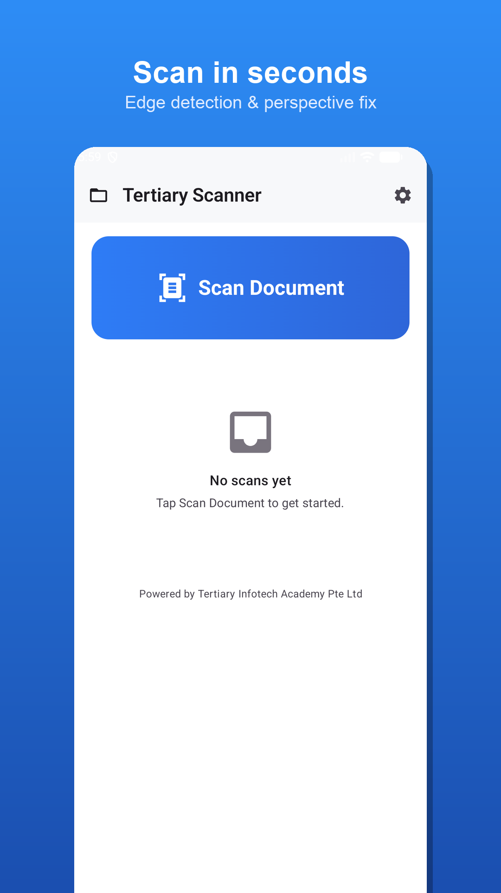
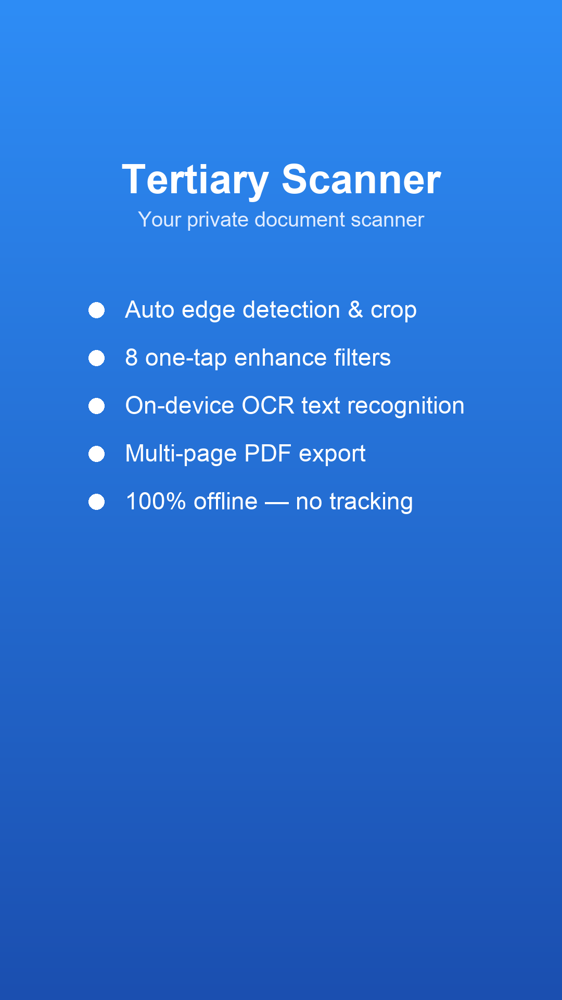
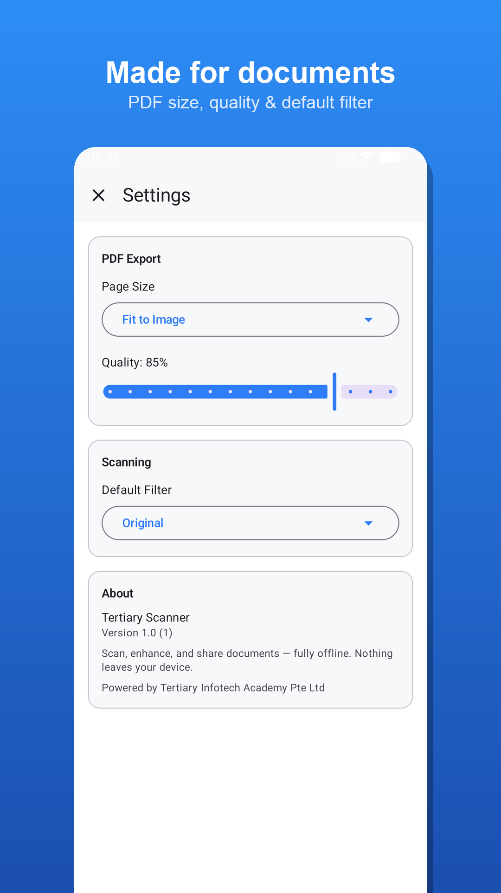
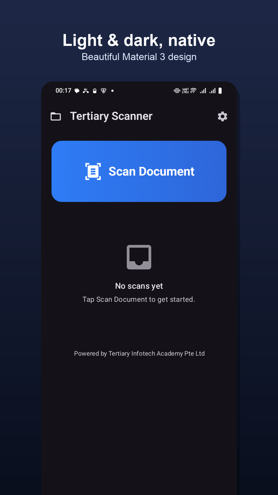

<div align="center">

# Tertiary Scanner — Android

[](https://developer.android.com)
[](https://kotlinlang.org)
[](https://developer.android.com/jetpack/compose)
[](https://developers.google.com/ml-kit)
[](#)

**Scan, enhance, OCR, and export documents to PDF/JPG — fully offline. Nothing leaves your device.**

[Report Bug](https://github.com/alfredang/scannerapp-android/issues) · [Request Feature](https://github.com/alfredang/scannerapp-android/issues)

</div>

## Screenshots

| Scan in seconds | Features | Made for documents | Light & dark |
|:---:|:---:|:---:|:---:|
|  |  |  |  |

## About

Tertiary Scanner is a **native Android document scanner** built in Kotlin and Jetpack Compose.
Capture a document with automatic edge detection and perspective correction, enhance it with
on-device image filters, recognize its text with OCR, and export a multi-page PDF or JPGs — all
**without a network connection**. There is no backend, no analytics, and no account: every step
runs on-device.

This is the Android port of the iOS *Tertiary Scanner*, rebuilt natively with the same features
and design.

### Features

- 📷 **Scan** — ML Kit Document Scanner: automatic edge detection, perspective correction,
  multi-page capture, and gallery import.
- 🎨 **Enhance** — 8 one-tap filters (Auto, White, B&W, Denoise, Bright, Sharpen, Receipt,
  Original), applied live; rotate pages 90°.
- 🔤 **OCR** — on-device text recognition (ML Kit); recognized text is saved and **searchable**.
- 📄 **Export** — share or save a multi-page **PDF** (A4 / Letter / Fit-to-image), save **JPGs**
  to Photos, save to **Files** (Storage Access Framework), or share the recognized text.
- 🗂️ **Library** — searchable document list (by name *or* recognized text), rename, duplicate,
  delete.
- 🔒 **Private** — no network access, no analytics, no accounts. All processing is on-device.

## Tech stack

| Area | Choice |
|------|--------|
| Language / UI | Kotlin 2.0, Jetpack Compose, Material 3 |
| Architecture | MVVM, manual DI (`AppContainer`) |
| Capture | `play-services-mlkit-document-scanner` (+ Photo Picker fallback) |
| OCR | `com.google.mlkit:text-recognition` |
| Imaging | `ImageProcessor` — ColorMatrix / LUT / convolution (ports of the iOS Core Image graphs) |
| PDF | `android.graphics.pdf.PdfDocument` |
| Persistence | Room (metadata) + JPEG files under `filesDir/Scans/` (images) |
| Settings | DataStore Preferences |
| Navigation | Navigation Compose |
| Build | Gradle 8.14.3, AGP 8.13.0, JDK 17, compileSdk 36, minSdk 24 |

## Architecture

```
┌──────────────────────────────────────────────────────────────┐
│  UI  (Jetpack Compose · Material 3 · Navigation Compose)       │
│  Home · Capture · Preview · Filter · Export · Library · …      │
└───────────────────────────────┬──────────────────────────────┘
                                 │ state / events
┌───────────────────────────────▼──────────────────────────────┐
│  ViewModels (MVVM)                                             │
│  ScannerViewModel · LibraryViewModel · SettingsViewModel       │
└───────────────────────────────┬──────────────────────────────┘
                                 │
┌───────────────────────────────▼──────────────────────────────┐
│  Services / Imaging  (Dispatchers.Default / IO)               │
│  ImageProcessor · OcrService · PdfService · ExportService      │
│  StorageService · BitmapIo                                     │
└───────────────────────────────┬──────────────────────────────┘
                                 │
┌───────────────────────────────▼──────────────────────────────┐
│  Data layer                                                    │
│  Room (metadata)  ·  JPEG files under filesDir/Scans/<id>/     │
│  DataStore (settings)                                          │
└──────────────────────────────────────────────────────────────┘
        ▲ ML Kit Document Scanner / Text Recognition (on-device)
```

## Project structure

```
app/src/main/java/com/tertiaryinfotech/scannerapp/
  model/      FilterType (8 enhancement filters)
  data/       Room entities, DAO, AppDatabase
  settings/   SettingsStore (DataStore Preferences)
  imaging/    ImageProcessor (ColorMatrix / LUT / convolution)
  service/    BitmapIo, OcrService, PdfService, ExportService, StorageService, Working*
  vm/         ScannerViewModel, LibraryViewModel, SettingsViewModel
  ui/         AppNav, Capture, screens, components, theme
  ScannerApplication.kt   AppContainer (manual DI)
store-assets/  Play Store listing assets, screenshots, icons
docs/          Hosted privacy policy (GitHub Pages)
```

## Getting started

### Prerequisites

- **Android Studio** (Ladybug or newer) with the Android SDK
- **JDK 17**
- An Android device or emulator running **API 24+**

### Build & run

```bash
export JAVA_HOME="/Applications/Android Studio.app/Contents/jbr/Contents/Home"
export ANDROID_HOME="$HOME/Library/Android/sdk"

./gradlew :app:assembleDebug     # debug APK  -> app/build/outputs/apk/debug/
./gradlew installDebug           # install on a connected device/emulator
./gradlew :app:bundleRelease     # signed AAB -> app/build/outputs/bundle/release/ (needs keystore.properties)
```

Or open the folder in **Android Studio** and press **Run ▶**.

> On emulators without Google Play services, capture falls back to the system Photo Picker.

## Release signing

Release builds read a **gitignored** `keystore.properties` at the repo root:

```properties
RELEASE_STORE_FILE=/absolute/path/to/upload-keystore.jks
RELEASE_STORE_PASSWORD=…
RELEASE_KEY_ALIAS=tertiary-scanner
RELEASE_KEY_PASSWORD=…
```

Keep the keystore **outside** the repo and **backed up** — it is required to publish updates.

## Privacy

Tertiary Scanner collects and shares **no data**. There is no network access; scanning,
enhancement, OCR, PDF generation, and storage all happen **on-device**. See the full
[privacy policy](store-assets/PRIVACY_POLICY.md).

## Contributing

Contributions are welcome:

1. Fork the repository
2. Create a feature branch (`git checkout -b feature/your-feature`)
3. Commit your changes (`git commit -m 'Add your feature'`)
4. Push the branch (`git push origin feature/your-feature`)
5. Open a Pull Request

## Acknowledgements

- [ML Kit](https://developers.google.com/ml-kit) — on-device document scanning & text recognition
- [Jetpack Compose](https://developer.android.com/jetpack/compose) & [Material 3](https://m3.material.io)

---

Developed by **Tertiary Infotech Academy Pte Ltd**.

⭐ If you find this project useful, please consider giving it a star.
